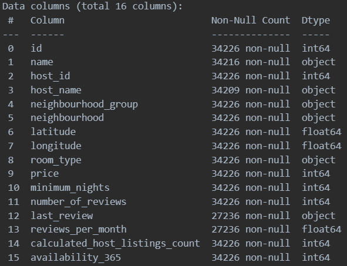
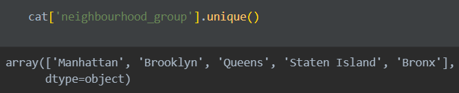
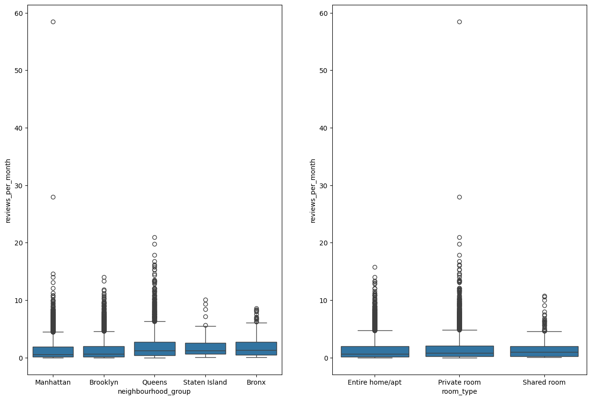
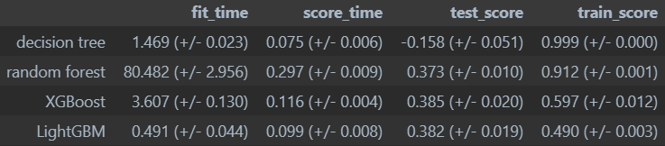

# CPSC 330 HW 5 Analysis

Airbnb is an online marketplace that connects people looking to rent out their homes with people who are looking for accommodations in that locale. It acts as a broker, receiving commissions from each booking. The platform offers a variety of lodging options, including single rooms, entire houses and apartments. This platform has become popular due to its user-friendly interface unique options and cheap prices that provide a different experience from traditional hotels.

In this analysis, we will be looking at the [New York City Airbnb Open Data](https://www.kaggle.com/dgomonov/new-york-city-airbnb-open-data) from 2019. This data file includes all needed information to find out more about hosts, geographical availability, necessary metrics to make predictions and draw conclusions. Using machine learning techniques, we will predict `reviews_per_month`. This variable is a proxy for the popularity of the listing. The higher the number of reviews per month, the more popular the listing is and vice versa.

## Components of the analysis

### Exploratory data analysis

The dataset contains some useful information about the Airbnb listings in New York City. It has `neighbourhood_group`, `neighbourhood`, `latitude`, `longitude`, `room_type`, `price`, `minimum_nights`, `number_of_reviews`, `last_review`, `reviews_per_month`, `calculated_host_listings_count`, `availability_365` columns.

The neighbourhood group is a categorical variable that has 5 unique values: `Bronx`, `Brooklyn`, `Manhattan`, `Queens`, `Staten Island`. The neighbourhood is a categorical variable that has 221 unique values. The room type is a categorical variable that has 3 unique values: `Entire home/apt`, `Private room`, `Shared room`. It is possible that these different categories can have different effects on the popularity of the listing. For example, the listings in Manhattan might be more popular than the listings in Bronx. The room type might also have an effect on the popularity of the listing. For example, the listings that are `Entire home/apt` might be more popular than the listings that are `Private room`.

The box plots provide a visual summary of the distribution of reviews per month for Airbnb listings across New York City's neighbourhood groups and by room type. The data indicates that while there is a broad range of reviews per month across all categories, the median number of reviews is relatively low, suggesting that the typical listing doesn't receive a high volume of reviews monthly. Both plots show outliers, which are listings receiving significantly more reviews than average. There seems to be a greater density of reviews in certain neighbourhoods and for specific types of rooms (like entire homes/apartments) The presence of outliers across all categories suggests that while most listings get a few reviews, a small number of listings are exceptionally popular, attracting a much higher number of reviews.

## Feature engineering
Feature engineering is like preparing the ingredients for cooking. You choose and prepare each piece of information about something you want to understand.It's about making sure your data is in the best shape for the computer to understand and solve a problem.

We derived two useful features:
- `price_minimum_nights`: the product of `price` and `minimum_nights`. This feature is a proxy for the total cost of the listing.
- `minimum_nights_host_listings`: the product of `minimum_nights` and `calculated_host_listings_count`. This feature is a proxy for the total number of nights the host has to accommodate.

## Preprocessing
Most of the time, the dataset is not ready for machine learning. It contains different types of values (number and object). It also has missing values and numeric features are in different scales. We need to preprocess the data to make it ready for machine learning. We will use the following preprocessing steps:

1. Dropping Features: Some columns like "id", "host_id", etc., are removed from the dataset because they don't provide useful information for predicting the number of reviews per month (our target).

2. Numerical Features: Columns with numbers (like "price" and "minimum_nights") are being processed in a specific way:
    - Missing values are filled with the median value of that column.
    - The values are then scaled so that they're centered around zero and have a variance of one, which helps certain algorithms work better.

3. Text Features: The "name" column, which contains text, is transformed by:
    - Replacing missing values
    - Converting the text into numerical data using a process that counts the frequency of the most important eight words after removing common English words (like "the", "is", etc.).
4. Categorical Features: Columns with category data (like "neighbourhood_group") are processed by:
    - Filling in missing values 
    - Converting categories into a format that the machine learning algorithms can understand (a process called one-hot encoding), without considering new, unseen categories (handle_unknown="ignore").
5. Discretization Features: The "latitude" and "longitude" columns are divided into 20 bins, which means their continuous values are split into 20 ranges and then converted into a format that the machine learning algorithms can use.

## Model selection
We tried different models to predict the number of reviews per month. The score of each model is shown below:

As you can see, decision tree and random forest models have the best scores. However, if the training socre is much higher than the validation score, it means that the model is overfitting.

- Overfitting: The model is too complex and is learning noise from the training data. It will not generalize well to new data.

That's why we will use the LightGBM model instead. Eventhough the train_score is less than others, the gap between train_score and test_score is the smallest. Also, the fit time is the shortest. It has the lowest chance of overfitting. Therefore, we can conclude that the lightGBM is the best model.

## LightGBM

LightGBM stands for Light Gradient Boosting Machine. It's like a team of experts who are trying to solve a problem. Each expert is good at solving a part of the problem, but not all of it. So, they work together to solve the problem:
1. The first expert takes a look at the problem and tries to solve it. He does a pretty good job, but he's not perfect. He makes some mistakes.
2. Add another expert to the team. This expert is good at solving the mistakes that the first expert made. He's not perfect either, but he's better than the first expert at solving the mistakes.
3. After some iterations, the team of experts solves the problem.

# Results

Our best model is the LightGBM compared to other different models, and hyperparameter optimization helps us to confirm this conclusion. Hyperparameter optimization is to find the best settings for a machine learning model to make it work as accurately as possible. Imagine you're baking cookies, and you have a recipe with a few ingredients like flour, sugar, and chocolate chips. Now, the amounts of these ingredients can affect how your cookies turn out. Hyperparameter optimization is like finding the perfect combination of these ingredient amounts to make the best cookies. 

Through trying the models with some default hyperparameters, hyperparameter optimization shows that the LightGBM model might be the best performing one in the selected model. like taking multiple quizzes using different sets of questions to ensure a student truly understands the material, the LightGBM achieves a relatively good cross-validation score through mutiple times of training from optimization. Even though this score seems not to be the highest, the LightGBM model is still standing out, considering it spends the shortest fitting time and the difference between the expected score (train_score) and the actual score (test_score) is the smallest. 

# Why our results might be incorrect

It is obvious that it does not necessarily mean that our results are perfect, there are still several parts of analysis being worth thinking over in the entire process:

1.The data processing needs to be treated more carefully. There is a column of the original dataset called "last review", which indicates the date of the last review for each rental house. This variable can potentially have a significant impact on the target variable "reviews_per_month.", such as predicting the temporal trend-more recent reviews contribute more to the popularity of the house and the overall review count. We decide to drop these time-ordered sequence of data points at that time, which could potentially mislead our preprocessor and impact the final result in uncertain ways. 

2.A more effective feature engineering can be explored. In our approach, we simply create two new variables "price_minimum_nights" and " minimum_nights_host_listings" by multiplying some relevant variables such as "price" and "minimum_nights" intuitively. Obviously, this method is not comprehensive and rigorous. Our model may overemphasize numeric variables and certain patterns, which might not actually contribute to predictive accuracy. It is worth noting the variable called "Name", the title of advertisement in text format. From this variable, we can explore some adjunct word "beautiful house" "amazing" and generate a positive and negative scoring analysis on each title, a more postive title may extract more attentions and leads to more reviews per month. Extracting more useful information can contribute to a better performance on our results.

# Your post must include the following elements (not necessarily in this order):

# Citations
All of the screenshots are generated by ourselves. The data is from the following sources:

1. New York City Airbnb dataset, https://www.kaggle.com/dgomonov/new-york-city-airbnb-open-data, 2019
2. CPSC 330, https://github.com/UBC-CS/cpsc330-2023W1, 2023
